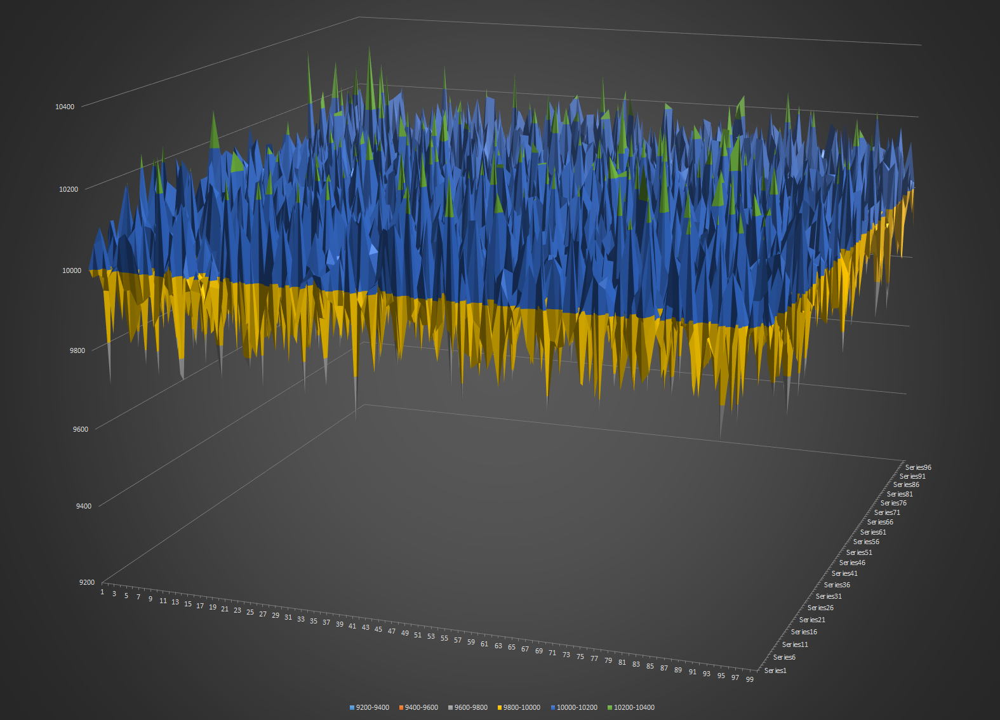

## A Solution for Random Shuffle List

### The Requirement

> A program that generates a list of 10,000 numbers in random order each time it is run. Each number in the list must be unique and be between 1 and 10,000 (inclusive).

### The Algorithm

> This solution implemented Durstenfeld's version of Fisher–Yates in place shuffle algorithm, time complexity is O(N) and space complexity is O(1).  
<pre><code>	To shuffle an array a of n elements (indices 0..n-1):
  				for i from 0 to n − 2 do
       				j ← random integer such that i ≤ j < n
       					exchange a[j] and a[i]</pre></code>
Reference at https://en.wikipedia.org/wiki/Fisher–Yates_shuffle.

#### Is this Solution 100% Random Shuffle?
> No, even though correctness of Fisher–Yates Algorithm can be mathematical proved. However because of following two reasons, this implementation is not able to achieve 100% random shuffle. 

* Modulo bias - To generate random numbers in every range from 0–1 to 0–n pretty much guarantees that some of these ranges will not evenly divide the natural range of the random number generator. Thus, the remainders will not always be evenly distributed and, worse yet, the bias will be systematically in favor of small remainders. Reference at https://en.wikipedia.org/wiki/Fisher%E2%80%93Yates_shuffle#Modulo_bias 
* Problem with pseudorandom generators (This is may or may not happens in C#). Referrence at https://en.wikipedia.org/wiki/Fisher%E2%80%93Yates_shuffle#Pseudorandom_generators:_problems_involving_state_space.2C_seeding.2C_and_usage

#### How random is this implementation?
> Following are two charts shows frequency of each number appears on each index (Ex. frequency of number 1 appears in index 1). Those two charts are based on size 100 random shuffle list which contains 1 to 100. First Chart shows frequency of 1000 such lists and second on based on 10000 such lists.

> In a prefect idea case, probably of each number appears on each index should be equal. However dude to two limitations discussed above (which are impossible to avoid because of natural of computing), this implementation is not perfect yet.

### Usage

####This solution contains three projects

* Pandell.RandomShuffledListGeneratorDemo - which contain code to show how to use actual random shuffler.
* Pandell.ListShuffler - class library, which contains two classes.
   * Implementations of Fisher–Yates in place shuffle algorithm.
   * API -  InPlaceShuffle<T> (List<T> list)
   * A RandomShuffledListGenerator - which can generate a list of 10,000 numbers in random order and each number in the list   is unique and be between 1 and 10,000 (inclusive).
   * API - GetShuffledIntListOneToTenThousand()
* Pandell.Tests - Unit Tests for Pandell.ListRandomShuffler, requires Nunit 2.6.

#### Required Library
* Nunit 2.6 or plus http://www.nunit.org/
* .Net 4.5

####Build and Run
* This solution works with VS2015 (it should work with VS2013 as well)
* To Run RandomShuffledListGeneratorDemo,<strong> set RandomShuffledListGeneratorDemo as start up project</strong>, build and run.
* To use ListShuffler in your code, simpley include class library in your code.
* For unit tests, please use Nunit-GUI 2.6 or plus which is avaiable at http://www.nunit.org/index.php?p=download
